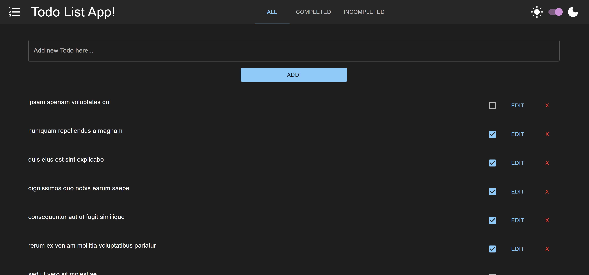

# Todo-List App

## Table Of Contents
- [Todo-List App](#todo-list-app)
  - [Table Of Contents](#table-of-contents)
  - [Introduction](#introduction)
  - [Technologies](#technologies)
  - [Installation](#installation)
  - [Screenshots](#screenshots)
    - [Home Page](#home-page)

## Introduction

A Todo List application that can help you manage your day to day tasks!!
This project was created as part of Home Assignment for Rezilion company.

## Technologies

* [React](https://reactjs.org/) v18.2.0
* [Material - UI](https://github.com/mui/material-ui) v5.11.15
* [Redux](https://github.com/reduxjs/redux-toolkit) v1.9.3
* [React-Redux](https://github.com/reduxjs/react-redux) v8.0.5
* [Redux-Persist](https://github.com/rt2zz/redux-persist) v6.0.0

## Installation

Use the package manager [npm](https://www.npmjs.com/) to install the Todo List App.

```npm
git clone "https://github.com/yuvalitah/todo-list-rezilion.git"
cd ../path/to/the/file
npm install
```
To start the project
```npm
npm start
```

## Screenshots

### Home Page

